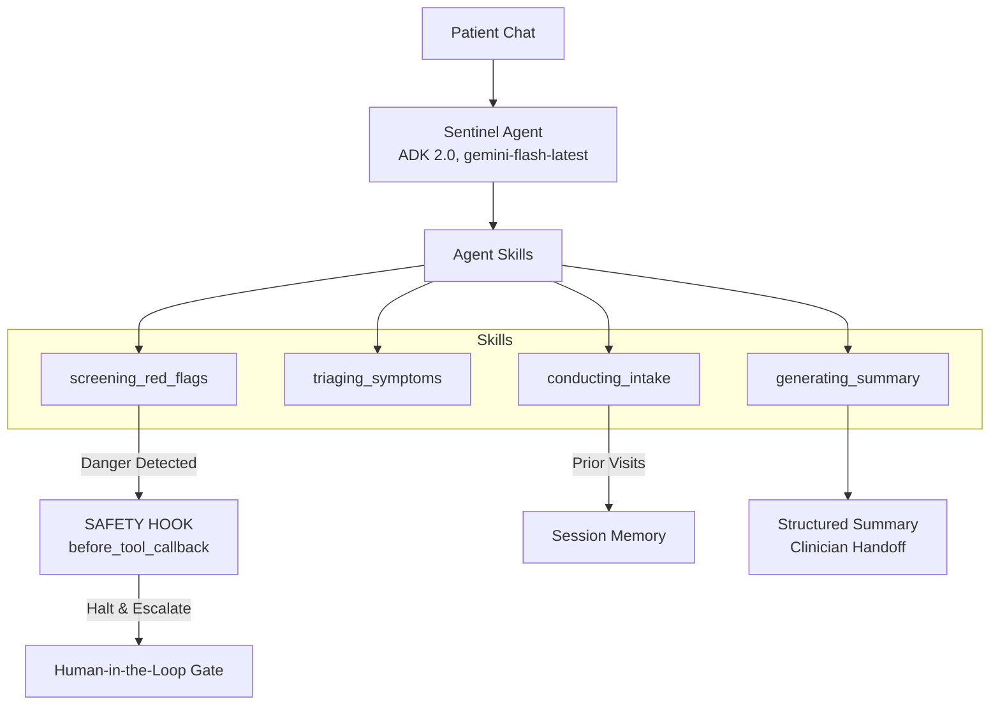

# Sentinel - Pre-Consultation Health Concierge Agent

**Track:** Concierge Agents
**Framework:** Google ADK Python 2.0
**Model:** gemini-flash-latest

---

## 🏥 Problem Statement
In busy clinics, clinicians spend valuable minutes gathering basic patient history and triaging symptoms. Patients often forget to mention key details or struggle to articulate their concerns clearly. Worse, patients sometimes wait for appointments when their symptoms indicate a medical emergency requiring immediate attention.

## 💡 Solution
Sentinel is a safe, AI-driven pre-consultation health concierge. Before a clinic visit, Sentinel interviews the patient to gather their chief complaint, duration, severity, and medical history. It then produces a structured clinician handoff summary and assigns a triage label. 

Crucially, **Sentinel's primary intelligence is knowing when to stop**. It employs deterministic safety guardrails to detect danger ("red-flag") symptoms, halt the intake, refuse to diagnose, and escalate the patient to a human clinician or emergency services immediately.

---

## 🏗️ Architecture

Sentinel is built using Google ADK 2.0 as a single, focused orchestrator agent (Level 2) driving four distinct procedural skills. It connects to external rules via the Model Context Protocol (MCP).



### Safety Spine (Security-Native Design)
1. **Red-Flag Check (`before_tool_callback`)**: A deterministic safety hook runs before triage. It inspects input against a defined danger-symptom list (`data/red_flags.py`). On a match, it blocks further tool execution and triggers escalation.
2. **Refusal to Diagnose**: System instructions contain "ABSOLUTE PROHIBITIONS" preventing the agent from giving medical advice, prescribing, or speculating on diagnoses.
3. **Circuit Breaker (Loop Protection)**: Uses ADK 2.0 native turn counting via `before_agent_callback`. If the conversation exceeds a predefined turn limit without completion, Sentinel escalates to a human instead of spinning indefinitely.
4. **Data Isolation**: Uses `InMemorySessionService` to scope memory securely per `user_id` and `session_id`, ensuring patient data doesn't leak.

---

## 🚀 Setup & Execution

### Prerequisites
- Python 3.10+
- A Google Gemini API Key

### Installation
1. Clone the repository:
   ```bash
   git clone https://github.com/smartbriefai/sentinel.git
   cd Sentinel_Capstone
   ```
2. Create a virtual environment and install dependencies:
   ```bash
   python -m venv .venv
   source .venv/bin/activate  # On Windows: .venv\Scripts\activate
   pip install -r requirements.txt
   ```
3. Set your API Key:
   Create a `.env` file in the project root and add your key:
   ```env
   GOOGLE_API_KEY="your_api_key_here"
   ```

### Running the Agent
Run the full MCP-integrated interactive CLI:
```bash
python -m sentinel
```

### Running the Test Suite (Golden Scenarios)
The test suite defines the Build Specifications (BDD/Gherkin) ensuring Sentinel handles routine visits, red-flag escalation, memory recall, refusal to diagnose, and runaway loop containment.
```bash
pytest tests/scenarios.py -v
```

---

## 🔑 Course Concepts Demonstrated
| Concept | Where in Sentinel |
|---------|-------------------|
| Agent (ADK) | The Sentinel orchestrator agent |
| Agent Skills | The 4 skills (procedural memory) |
| MCP Server | Triage/reference data exposed as a FastMCP tool via `tools/triage_mcp_server.py` |
| Security features | Red-flag hook, never-diagnose guardrail, HITL gate, circuit breaker |
| Deployability | ADK Runner setup is cloud-ready (GCP Cloud Run compatible) |
| Antigravity | Used to plan, build, and debug the architecture iteratively |
